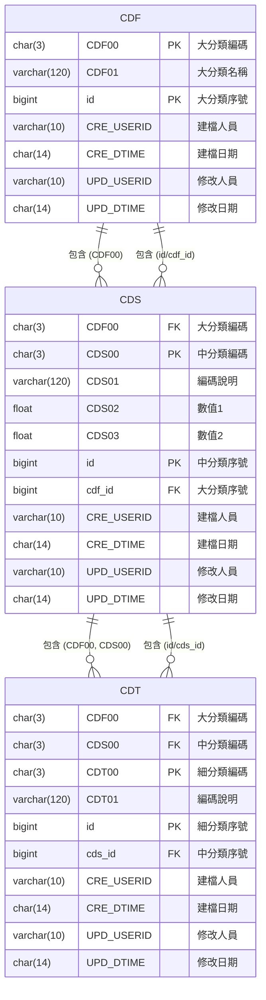

# 開發計畫 (PLAN): 1. 基本作業 - 代碼維護
**版本**: 1.0
**狀態**: [草稿]
**負責人**: [技術主管/架構師]
**對應 SPEC**: `1. 基本作業 - 代碼維護.spec.md (v1.1)`
**依據憲章**: `Project_Constitution_v2.1.0.md`

## 1. 憲章遵循檢查 (Constitution Check) - [憲章 H3]
(此為憲章 H3 強制要求。**必須**逐項檢查)

| 憲章條款 | 遵循狀態 | 備註 (如何實現) |
| :--- | :--- | :--- |
| **P1: 簡潔優先** | [遵循] | 採用標準化的前端狀態管理，避免複雜的即時儲存邏輯。 |
| **P2: 設計即安全** | [遵循] | API 將使用 .NET Core 的 `[Authorize(Roles="系統管理員")]` 屬性進行端點防護。所有 CUD 操作將記錄 `UPD_USERID`。 |
| **P3: 可測試性** | [遵循] | 參見本文件 `3. 測試策略`。前端狀態變更（待新增/修改）亦可被測試。 |
| **P4: 漸進交付** | [遵循] | 任務將依 `4. 任務拆解` 順序交付，API 優先。 |
| **P5: 主要語言** | [遵循] | API 回應的驗證錯誤訊息將使用正體中文（zh-TW）。 |
| **P6: 程式碼品質** | [遵循] | PR (Pull Request) **必須**通過 Code Review 方可合併。 |
| **P7: 嚴謹測試** | [遵循] | 參見 `3. 測試策略`，重點測試批次儲存的交易完整性。 |
| **P8: UX 一致性** | [遵循] | 1. 採用 `設計規範v2.0.md` 的 UI 元件。 2. 嚴格遵循 `P8.3` 規範，提供「儲存」/「取消」按鈕，**不使用**自動儲存。 |
| **P9: 效能要求** | [遵循] | `CDF00`, `CDS00`, `CDT00` 等關聯鍵值將建立資料庫索引，確保 `GET` API 效能達標。 |
| **P10: 架構設計** | [遵循] | 本功能將作為 `BasicData` 模組，在「模組化單體」架構中開發。 |
| **P11: 技術堆疊** | [遵循] | 後端: ASP.NET Core 8； 前端: Next.js 14； 資料庫: MS SQL Server。 |
| **P12: 數據治理** | [遵循] | 1. `CDF`, `CDS`, `CDT` 表的 Schema 變更將使用 EF Core Migrations 管理。 2. 嚴格禁止跨模組直接存取 `CDF/CDS/CDT` 表，未來其他模組需透過本模組 API 取得代碼。 |
| **P13: 可觀測性** | [遵循] | 批次儲存 API (不論成功或失敗) **必須** 寫入 `Serilog` 結構化日誌。 |

## 2. 技術架構 (Technical Architecture)

### 2.1 資料庫設計 (Data Model)
(依據 `CDF_TABLE.md`, `CDS_TABLE.md`, `CDT_TABLE.md` 檔案繪製)

