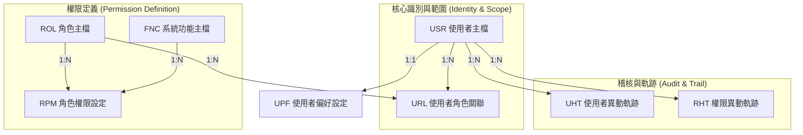

# 身分識別與權限管理 (IAM) 架構統整與設計摘要

**文件版本**: v1.2.0
**建立日期**: 2025-12-03
**狀態**: 正式定案 (Finalized)
**目的**: 統整 USR, ROL, URL, FNC, RPM 資料表關係、設計目的及關鍵策略，作為後續討論基準。

---

## 1. 整體架構關係圖 (Conceptual ERD)

本系統採用 **RBAC (Role-Based Access Control) + Data Scope (資料範圍)** 的雙重控管模型。

*   **USR**: 是誰？ (Who)
*   **ROL**: 擔任什麼職務？ (Role)
*   **URL**: 在哪裡擔任此職務？ (Where / Scope)
*   **FNC**: 系統能做什麼？ (What)
*   **RPM**: 此職務能做哪些事？ (Permission)

---

## 2. 資料表目的與核心設計

### 🟢 1. USR - 使用者主檔 (User Master)
*   **目的**: 系統內部的「唯一身分識別中心」。
*   **核心設計**:
    *   **Snowflake ID**: 作為 PK (`USER_ID`)，解決效能與排序問題，不依賴 AD 或舊 ID。
    *   **混合驗證 (Hybrid Auth)**: 透過 `ACCOUNT_TYPE` 區分：
        *   `AD`: 內部員工，密碼由 AD 管理。
        *   `LOCAL`: 外部客戶/系統，密碼由本系統雜湊管理。
    *   **歷史相容**: `OLD_USERID` 欄位保留舊系統 ID，確保歷史資料可查詢。
    *   **AD 整合**: `AD_ACCOUNT` 欄位儲存與 AD 的連結。

### 🟢 2. ROL - 角色主檔 (Role Master)
*   **目的**: 定義企業內的「職務功能群組」，而非針對個人授權。
*   **核心設計**:
    *   **角色類型**: `ROLE_TYPE` 區分 `INTERNAL` (如：倉管、會計) 與 `EXTERNAL` (如：客戶經辦)。
    *   **系統預設**: `IS_SYSTEM` 保護核心角色（如超級管理員）不被誤刪。

### 🟢 3. URL - 使用者角色關聯 (User-Role Link)
*   **目的**: 將「人」與「角色」連結，並加上最重要的**「資料範圍 (Data Scope)」**。
*   **核心設計**:
    *   **範圍控制**: 這是本系統權限模型最關鍵的差異點。
        *   `SCOPE_TYPE`: `GLOBAL` (全域), `WAREHOUSE` (倉庫), `CUSTOMER` (客戶)。
        *   `SCOPE_VALUE`: 指定具體的倉庫 ID (`WH01`) 或客戶 ID (`CUST001`)。
    *   **多重身分**: 同一人可擁有多筆記錄 (例如：在 A 倉是經理，在 B 倉只是檢視者)。

### 🟢 4. FNC - 系統功能主檔 (Function Master)
*   **目的**: 列出系統所有「可被控制的資源」，從選單到按鈕。
*   **核心設計**:
    *   **樹狀結構**: `PARENT_ID` 支援無限層級 (模組 -> 選單 -> 功能點)。
    *   **功能類型**: `FUNC_TYPE` 區分 `MODULE` (目錄)、`MENU` (頁面)、`ACTION` (按鈕/API)。
    *   **細緻度**: 支援到「按鈕級」的顯示/隱藏控制。

### 🟢 5. RPM - 角色權限設定 (Role-Permission Mapping)
*   **目的**: 定義「某個角色」可以使用「哪些功能」。
*   **核心設計**:
    *   **授權模式**: 採用 **Item-Based (項目制)** 與 **Allow List (正面表列)**。
    *   **運作邏輯**: `RPM` 表僅儲存 `ROLE_ID` 與 `FUNC_ID` 的關聯。有資料 = 有權限。
    *   **UI 實作**:
        *   **僅讀取**: 僅授予 `MENU` 節點權限。
        *   **可編輯**: 授予 `MENU` 節點 + 該頁面下所有 `ACTION` 節點 (新增/修改/刪除) 權限。

### 🟢 6. UHT - 使用者異動軌跡 (User History Trail)
*   **目的**: 記錄 `USR` 表的所有生命週期變化，補足系統面稽核缺口。
*   **核心設計**:
    *   **Before/After**: 使用 JSON 格式完整記錄欄位變更前後值。
    *   **全方位監控**: 包含手動修改、AD 同步觸發、系統自動停用等所有來源。

### 🟢 7. RHT - 權限異動軌跡 (Role/Permission History Trail)
*   **目的**: 資安稽核核心，記錄「誰」在「何時」被賦予或移除了「什麼權限」。
*   **核心設計**:
    *   **WORM**: 寫入後不可修改刪除。
    *   **Scope Change**: 若涉及資料範圍變更，亦詳細記錄。

---

## 3. 近期關鍵討論與策略總結

1.  **身分識別策略 (Identity Strategy)**:
    *   **決策**: 放棄 UUID，全面採用 **Snowflake ID (bigint)** 以提升索引效能與儲存效率。
    *   **決策**: 採用 **AD First** 策略，優先驗證 AD 帳號；若遇與外部帳號重名，透過資料清洗 (Data Cleansing) 為外部帳號更名來解決。

2.  **新舊並存與轉移 (Migration & Coexistence)**:
    *   **現況**: 舊系統 (EEP) 使用 `USERS` (Varchar PK) 等系統表，結構不可修改。
    *   **決策**: 採用 **方案 A (雙軌制)**，建立新 IAM 表 (`USR`)，透過 Trigger 與舊表同步，確保舊系統穩定。

3.  **營運持續計畫 (BCP - Business Continuity Plan)**:
    *   **風險**: 當 AD 連線中斷時。
    *   **對策**: 
        1.  **HA**: 多台 DC 備援。
        2.  **緊急授權**: 允許 `admin_local` 批次開啟臨時 Local 密碼權限 (有時效性)，確保倉庫作業不中斷。

---

## 4. 新舊帳號移轉與共存策略 (Finalized Strategy)

經評估舊系統 (EEP + Delphi) 特性後，確認採用 **雙軌制 (Dual Track)** 策略。

### 4.1 核心決策
1.  **不動舊結構**: 嚴禁修改 EEP 系統底層表 (`USERS`, `USERGROUPS`)，以避免舊系統崩潰。
2.  **DB Trigger 同步**: 利用 Trigger 實現 `USERS` -> `USR` 的單向即時同步。
3.  **權限脫鉤**: 舊系統權限 (Menu) 與新系統權限 (Function) 邏輯不同，採 **獨立維護**，不進行同步。

### 4.2 資料表對照與處置表

| 新系統資料表 | 舊系統對應 (EEP) | 關係與處置策略 |
| :--- | :--- | :--- |
| **USR** (使用者) | `USERS` | **同步 (Sync)**。建立 Trigger，當 `USERS` 異動時，同步更新 `USR` (含 `OLD_USERID` 連結)。 |
| **ROL** (角色) | `USERGROUPS` | **轉換 (Transform)**。將舊系統的「群組」視為新系統的「角色」。透過 ETL 初始化匯入，後續可透過 Trigger 或手動維護同步。 |
| **URL** (關聯) | `USERGROUPS` | **同步 (Sync)**。當舊系統將 User 加入 Group 時，Trigger 自動在 `URL` 表建立 User-Role 關聯。 |
| **FNC** (功能) | `USERMENUS` | **脫鉤 (Decouple)**。新舊功能完全不同，`FNC` 表全新建立，不從舊系統同步。 |
| **RPM** (權限) | (無直接對應) | **重構 (Rebuild)**。在新系統中重新定義角色對 `FNC` 的權限。 |
| **UPF** (偏好) | (無) | **新增 (New)**。新系統獨有功能，獨立運作。 |
| **UHT** (歷程) | (無) | **新增 (New)**。新系統全自動記錄使用者異動 (取代舊系統分散 Log)。 |
| **RHT** (歷程) | (無) | **新增 (New)**。新系統資安核心，記錄權限賦予歷程。 |
| **UGA** (參數) | `UGA` | **擱置 (Pending)**。確認與權限無關，暫不納入 IAM 範圍。 |

### 4.3 移轉路徑 (Migration Path)
1.  **準備期**: 建立 IAM 表，開發 ETL Script (舊轉新)，部署 Trigger。
2.  **並行期**: 
    *   User 異動 -> Trigger 自動同步。
    *   User 登入 -> 舊系統查 `USERS`，新系統查 `USR` (驗證 AD/Local)。
    *   權限 -> 舊系統管 EEP Form，新系統管 Web Page (獨立設定)。
3.  **退場期**: 所有模組移轉完成後，移除 Trigger，停用舊系統。

---
*此文件由 AI 專案顧問統整，更新於 2025-12-03。*
