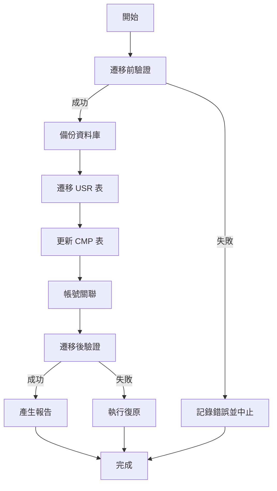

# 規格文件 (SPEC): 資料遷移 Migration (Data Migration)

**文件版本**: v1.0.0
**狀態**: 草稿 (Draft)
**建立日期**: 2026-01-01
**依據**: 
- `0.standards/0.專案憲章-總規範-SDD工作流程/1.專案憲章 Project Constitution.md`
- `0.standards/4.資料庫結構分析/8.系統管理作業/1.身分識別與權限管理/USR_使用者主檔.md`
- `0.standards/4.資料庫結構分析/1.基本作業/3.客戶資料維護/CMP_TABLE.md`
- `0.standards/4.資料庫結構分析/8.系統管理作業/1.身分識別與權限管理/0.2.客戶資料維護與IAM整合設計總結.md`
- `0.standards/4.資料庫結構分析/8.系統管理作業/1.身分識別與權限管理/0.身分識別與帳號整合策略.md`

---

## 1. 目的 (Purpose)

本模組定義從舊系統 `users` 和 `CMP` 表遷移至新系統 `USR` 和 `CMP` 表的完整策略與執行規範。確保歷史資料完整性、帳號關聯正確性，並建立完整的帳號對應關係，以支援歷史單據查詢與稽核需求。

**核心目標**：
- 將舊系統的使用者帳號資料完整遷移至新系統 IAM 架構
- 建立舊系統帳號與新系統 Snowflake ID 的對應關係
- 自動關聯客戶聯絡人（CMP）與使用者帳號（USR）
- 處理內部員工 AD 帳號對照關係
- 產生例外清單供人工審核與修復

---

## 2. 範圍 (Scope)

**包含功能**:
- 舊系統 `users` 表 → 新系統 `USR` 表遷移
- 舊系統 `CMP` 表 → 新系統 `CMP` 表更新（新增 `CMP_UID`, `CMP30-32` 欄位）
- 帳號自動關聯邏輯（`users.userid` = `CMP.CMP00`）
- AD 帳號對照表處理（內部員工舊帳號 vs AD 帳號）
- 例外清單產生與人工處理流程
- 資料驗證與完整性檢查
- 復原策略與備份機制

**排除功能**:
- 歷史業務單據的 `created_by`/`updated_by` 欄位更新（後續階段處理）
- 其他資料表的遷移（非本階段範圍）
- 角色與權限的遷移（由其他模組處理）

---

## 3. 資料對應策略 (Data Mapping Strategy)

### 3.1 舊系統 users 表 → 新系統 USR 表

#### 3.1.1 欄位對應規則

| 舊系統欄位 (users) | 新系統欄位 (USR) | 對應規則 | 備註 |
|:---|:---|:---|:---|
| `userid` | `OLD_USERID` | 直接複製 | 保留舊 ID 用於歷史查詢 |
| `userid` | `LOCAL_ACCOUNT` | 條件複製 | 當 `ACCOUNT_TYPE='LOCAL'` 時 |
| `userid` | `AD_ACCOUNT` | 條件複製 | 當 `ACCOUNT_TYPE='AD'` 且對照表有對應時 |
| `name` | `USER_NAME` | 直接複製 | 必填欄位 |
| `email` | `EMAIL` | 直接複製 | 可為 NULL |
| `department` | `DEPARTMENT` | 直接複製 | 可為 NULL |
| `title` | `TITLE` | 直接複製 | 可為 NULL |
| - | `USER_ID` | 系統產生 | Snowflake ID (PK) |
| - | `ACCOUNT_TYPE` | 邏輯判斷 | 'AD' 或 'LOCAL' |
| - | `DOMAIN_NAME` | 預設值 | 'CORP' |
| - | `STATUS` | 邏輯判斷 | 1=啟用, 0=停用（若在 CMP 中找不到對應則設為 0） |
| - | `PASSWORD_HASH` | 條件處理 | 僅 `ACCOUNT_TYPE='LOCAL'` 時處理（需從舊系統密碼欄位遷移） |

#### 3.1.2 ACCOUNT_TYPE 判斷邏輯

**判斷順序**：
1. **檢查 AD 對照表**：若 `users.userid` 在對照表中存在，且對照表有 `AD_ACCOUNT` 值
   - → `ACCOUNT_TYPE='AD'`
   - → `AD_ACCOUNT` = 對照表中的 AD 帳號
   - → `OLD_USERID` = `users.userid`
   - → `PASSWORD_HASH` = NULL

2. **檢查 CMP 對應**：若 `users.userid` 在 `CMP.CMP00` 中存在
   - → `ACCOUNT_TYPE='LOCAL'`
   - → `LOCAL_ACCOUNT` = `users.userid`
   - → `OLD_USERID` = `users.userid`
   - → `PASSWORD_HASH` = 從舊系統遷移（需解密或重新雜湊）

3. **孤立帳號處理**：若 `users.userid` 在對照表和 CMP 中都找不到
   - → `ACCOUNT_TYPE='LOCAL'`（預設）
   - → `LOCAL_ACCOUNT` = `users.userid`
   - → `OLD_USERID` = `users.userid`
   - → `STATUS=0`（已離職，無法登入）
   - → 列入例外清單

#### 3.1.3 STATUS 判斷邏輯

- **預設值**：`STATUS=1`（啟用）
- **例外情況**：
  - 若 `users.userid` 在 CMP 表中找不到對應 → `STATUS=0`（已離職）
  - 若舊系統有停用標記（需確認舊系統欄位） → `STATUS=0`

---

### 3.2 舊系統 CMP 表 → 新系統 CMP 表

#### 3.2.1 既有欄位保留

所有既有欄位（CMP00, CMP01, CMP03, ..., CMP29）直接保留，不進行轉換。

#### 3.2.2 新增欄位處理

| 新欄位 | 來源 | 處理邏輯 | 備註 |
|:---|:---|:---|:---|
| `CMP_UID` | 自動關聯 | 透過 `CMP.CMP00` 與 `USR` 表關聯 | 見 4.1 節「自動關聯規則」 |
| `CMP30` (status_change_reason) | 邏輯判斷 | 若 `CMP20='Y'` (已停用) 且 `CMP21` (停用日期) 有值 → 填入預設原因「Migration: 舊系統停用」 | 若無停用記錄則為 NULL（需後續補填） |
| `CMP31` (status_change_date) | 直接複製 | 從 `CMP21` (disabled_date) 複製 | 格式：YYYYMMDD |
| `CMP32` (status_change_type) | 邏輯判斷 | 若 `CMP20='Y'` → 'DISABLE'<br>若 `CMP20='N'` → 'ENABLE' | 必填欄位 |

**重要注意事項**：
- `CMP30-32` 為必填欄位，但 Migration 時可能無法取得完整的歷史原因
- 建議 Migration 後，由管理員補填缺失的原因與日期
- 或設定預設值：「Migration: 資料遷移時自動設定」

---

## 4. 帳號關聯邏輯 (Account Mapping Logic)

### 4.1 自動關聯規則

**關聯優先順序**（依序嘗試，找到即停止）：

1. **第一優先**：`CMP.CMP00` = `USR.LOCAL_ACCOUNT` (完全匹配)
   - 適用情境：外部客戶帳號
   - 關聯方式：直接設定 `CMP.CMP_UID = USR.USER_ID`

2. **第二優先**：`CMP.CMP00` = `USR.OLD_USERID` (舊帳號匹配)
   - 適用情境：舊系統帳號（無論 AD 或 LOCAL）
   - 關聯方式：直接設定 `CMP.CMP_UID = USR.USER_ID`

3. **第三優先**：`CMP.CMP00` = `USR.AD_ACCOUNT` (AD 帳號匹配)
   - 適用情境：內部員工（需透過對照表）
   - 關聯方式：直接設定 `CMP.CMP_UID = USR.USER_ID`
   - **注意**：此情況較少見，因為 CMP00 通常存的是舊帳號，而非 AD 帳號

### 4.2 例外處理

#### 4.2.1 Orphan CMP（孤立客戶聯絡人）

**情境**：CMP 記錄找不到對應的 USR 記錄

**處理方式**：
- `CMP.CMP_UID` = NULL
- 列入例外清單，欄位包含：
  - `CMP_ID`, `CMP00` (帳號), `CMP01` (姓名), `CM00` (客戶編號)
  - 無法關聯的原因：「找不到對應的 USR 記錄」

**後續處理**：
- 管理員需人工判斷：
  - 若該聯絡人需開通帳號 → 透過「補建帳號」功能建立 USR 並關聯
  - 若該聯絡人不需要帳號 → 保持 `CMP_UID=NULL`

#### 4.2.2 Duplicate Mapping（重複對應）

**情境**：一個 `CMP00` 對應到多個 USR 記錄

**處理方式**：
- `CMP.CMP_UID` = NULL（不自動關聯）
- 列入例外清單，欄位包含：
  - `CMP_ID`, `CMP00`, `CMP01`
  - 所有可能的 USR 記錄（USER_ID, ACCOUNT_TYPE, LOCAL_ACCOUNT, AD_ACCOUNT）
  - 無法關聯的原因：「一個 CMP00 對應到多個 USR 記錄，需人工判斷」

**後續處理**：
- 管理員需人工判斷正確的 USR 記錄
- 手動更新 `CMP.CMP_UID`

#### 4.2.3 Missing CMP（缺少客戶聯絡人）

**情境**：USR 記錄找不到對應的 CMP 記錄

**處理方式**：
- 僅記錄於例外清單（不影響 CMP 遷移）
- 欄位包含：
  - `USER_ID`, `ACCOUNT_TYPE`, `LOCAL_ACCOUNT`, `AD_ACCOUNT`, `OLD_USERID`, `USER_NAME`
  - 無法關聯的原因：「找不到對應的 CMP 記錄（可能是內部員工）」

**後續處理**：
- 此情況通常為內部員工，不需要 CMP 記錄
- 僅需確認該 USR 記錄正確即可

---

## 5. AD 帳號對照表格式 (Mapping Table Format)

### 5.1 Excel 格式範本

**檔案名稱建議**：`AD帳號對照表_YYYYMMDD.xlsx`

**欄位定義**：

| 欄位名稱 | 欄位說明 | 資料型態 | 必填 | 範例 |
|:---|:---|:---|:---:|:---|
| 舊系統帳號 (OLD_USERID) | 舊系統的 userid | varchar(20) | ✅ | xyz |
| AD 帳號 (AD_ACCOUNT) | Active Directory 的 sAMAccountName | varchar(50) | ✅ | xyz.123 |
| 姓名 (USER_NAME) | 使用者姓名 | nvarchar(50) | ✅ | 張三 |
| 部門 (DEPARTMENT) | 所屬部門 | nvarchar(50) | ❌ | 資訊部 |
| 職稱 (TITLE) | 職稱 | nvarchar(50) | ❌ | 工程師 |
| 備註 (REMARKS) | 其他說明 | nvarchar(200) | ❌ | 內部員工 |

**範例資料**：

| 舊系統帳號 | AD 帳號 | 姓名 | 部門 | 職稱 | 備註 |
|:---|:---|:---|:---|:---|:---|
| xyz | xyz.123 | 張三 | 資訊部 | 工程師 | 內部員工 |
| abc | abc.456 | 李四 | 業務部 | 業務專員 | 內部員工 |
| wilson | wilson.tzou | 周威爾 | 管理部 | 系統管理員 | 內部員工 |

### 5.2 處理邏輯

1. **讀取對照表**：Migration 程式讀取 Excel 檔案
2. **建立 USR 記錄**：
   - `ACCOUNT_TYPE='AD'`
   - `AD_ACCOUNT` = 對照表中的 AD 帳號
   - `OLD_USERID` = 對照表中的舊系統帳號
   - `USER_NAME` = 對照表中的姓名（若對照表有提供，優先使用；否則從 users 表取得）
   - `DEPARTMENT`, `TITLE` = 對照表中的值（若對照表有提供，優先使用）
   - `PASSWORD_HASH` = NULL（AD 帳號不需密碼）
   - `STATUS=1`（預設啟用）

3. **驗證**：
   - 檢查 `AD_ACCOUNT` 唯一性
   - 檢查 `OLD_USERID` 是否在 users 表中存在
   - 若對照表中的 `OLD_USERID` 在 users 表中找不到 → 列入例外清單

---

## 6. 使用者故事 (User Stories)

### US-MIG-001: 執行資料遷移

**作為** 系統管理員
**我想要** 執行 Migration Script 將舊系統資料遷移至新系統
**以便於** 新系統可以正常運作並保留歷史資料

**驗收條件 (Acceptance Criteria)**:
1. Migration Script 可成功執行，無致命錯誤
2. 所有 `users` 記錄成功轉換為 `USR` 記錄（100% 轉換率）
3. 所有 `CMP` 記錄成功更新（新增 `CMP_UID`, `CMP30-32` 欄位）
4. 自動關聯成功率 > 90%（CMP 有 CMP_UID 的比例）
5. 產生完整的例外清單報告（Excel 或 CSV 格式）
6. 產生資料驗證報告（筆數統計、關聯完整性、抽樣驗證）

### US-MIG-002: 處理例外清單

**作為** 系統管理員
**我想要** 檢視無法自動關聯的記錄清單
**以便於** 人工判斷並修復關聯問題

**驗收條件 (Acceptance Criteria)**:
1. 例外清單包含完整資訊：
   - Orphan CMP：CMP_ID, CMP00, CMP01 (姓名), CM00 (客戶編號), 無法關聯的原因
   - Duplicate Mapping：CMP_ID, CMP00, 所有可能的 USR 記錄清單
   - Missing CMP：USER_ID, ACCOUNT_TYPE, LOCAL_ACCOUNT, AD_ACCOUNT, OLD_USERID, USER_NAME
2. 提供人工修復介面或 SQL Script
3. 修復後可重新執行驗證，確認關聯正確性
4. 修復記錄需寫入日誌，供後續追蹤

### US-MIG-003: 驗證遷移結果

**作為** 系統管理員
**我想要** 驗證遷移後的資料完整性
**以便於** 確保資料正確無誤

**驗收條件 (Acceptance Criteria)**:
1. **資料筆數驗證**：
   - USR 筆數 = users 筆數（允許 ±5% 誤差，因可能有重複或無效資料）
   - CMP 筆數 = 舊系統 CMP 筆數（應完全一致）
2. **關聯完整性驗證**：
   - CMP 有 CMP_UID 的比例 > 95%
   - 所有 CMP_UID 都必須存在於 USR.USER_ID（外鍵完整性）
3. **資料正確性驗證**：
   - 抽樣檢查 10% 的記錄，確認姓名、帳號等欄位是否正確
   - 檢查 ACCOUNT_TYPE 判斷是否正確（AD vs LOCAL）
   - 檢查 STATUS 設定是否合理
4. **產生驗證報告**：包含上述所有驗證結果的詳細報告

---

## 7. 資料驗證規則 (Data Validation Rules)

### 7.1 遷移前驗證 (Pre-Migration Validation)

**必須通過以下檢查才能執行遷移**：

1. **資料來源檢查**：
   - [ ] `users` 表必須存在且可讀取
   - [ ] `CMP` 表必須存在且可讀取
   - [ ] 舊系統資料庫連線正常

2. **對照表檢查**（若提供）：
   - [ ] AD 對照表檔案格式正確（Excel 或 CSV）
   - [ ] 必填欄位（OLD_USERID, AD_ACCOUNT, USER_NAME）不為空
   - [ ] AD_ACCOUNT 欄位無重複值
   - [ ] OLD_USERID 欄位無重複值

3. **目標系統檢查**：
   - [ ] 新系統 `USR` 表已建立且結構正確
   - [ ] 新系統 `CMP` 表已建立且結構正確（包含新增欄位）
   - [ ] 新系統資料庫連線正常
   - [ ] 新系統 `USR` 表為空（或確認可覆蓋）
   - [ ] 新系統 `CMP` 表為空（或確認可覆蓋）

4. **備份檢查**：
   - [ ] 已完整備份新系統資料庫
   - [ ] 已完整備份舊系統資料庫
   - [ ] 備份檔案已驗證可還原

### 7.2 遷移中驗證 (During Migration Validation)

**每個記錄處理時必須通過以下檢查**：

1. **USR 記錄驗證**：
   - [ ] Snowflake ID 產生成功（不為 NULL）
   - [ ] 必填欄位不為空（USER_NAME, ACCOUNT_TYPE）
   - [ ] ACCOUNT_TYPE 值為 'AD' 或 'LOCAL'
   - [ ] 帳號唯一性檢查：
     - `LOCAL_ACCOUNT` 不重複（當 ACCOUNT_TYPE='LOCAL' 時）
     - `AD_ACCOUNT` 不重複（當 ACCOUNT_TYPE='AD' 時）
   - [ ] 若 ACCOUNT_TYPE='LOCAL'，PASSWORD_HASH 不為空
   - [ ] 若 ACCOUNT_TYPE='AD'，PASSWORD_HASH 為 NULL

2. **CMP 記錄驗證**：
   - [ ] CMP_UID 外鍵檢查（若 CMP_UID 不為 NULL，必須存在於 USR.USER_ID）
   - [ ] CMP32 (status_change_type) 必填且值為 'DISABLE' 或 'ENABLE'
   - [ ] 若 CMP32='DISABLE'，CMP30 (status_change_reason) 和 CMP31 (status_change_date) 必填
   - [ ] CMP31 (status_change_date) 格式正確（YYYYMMDD，8 位數字）

### 7.3 遷移後驗證 (Post-Migration Validation)

**遷移完成後必須產生以下報告**：

1. **資料筆數統計報告**：
   - 舊系統 users 筆數 vs 新系統 USR 筆數
   - 舊系統 CMP 筆數 vs 新系統 CMP 筆數
   - 差異分析（如有差異，需說明原因）

2. **關聯完整性報告**：
   - CMP 有 CMP_UID 的筆數與比例
   - CMP_UID 為 NULL 的筆數與清單
   - 外鍵完整性檢查結果（所有 CMP_UID 都必須存在於 USR.USER_ID）

3. **例外清單報告**：
   - Orphan CMP 清單（詳細資訊）
   - Duplicate Mapping 清單（詳細資訊）
   - Missing CMP 清單（詳細資訊）

4. **資料抽樣驗證報告**：
   - 隨機抽樣 10% 的 USR 記錄，檢查欄位正確性
   - 隨機抽樣 10% 的 CMP 記錄，檢查欄位正確性
   - 驗證結果（正確/錯誤/需人工確認）

---

## 8. 復原策略 (Rollback Strategy)

### 8.1 前提條件

**遷移前必須完成**：
- [ ] 完整備份新系統資料庫（包含所有資料表）
- [ ] 完整備份舊系統資料庫（包含所有資料表）
- [ ] 備份檔案已驗證可還原
- [ ] 備份檔案已儲存至安全位置（至少保留 30 天）

### 8.2 復原觸發條件

**以下情況應立即執行復原**：
1. Migration Script 執行失敗（致命錯誤）
2. 資料驗證失敗（筆數差異過大、關聯完整性錯誤）
3. 業務驗收測試失敗（無法正常運作）
4. 資料遺失或損壞

### 8.3 復原步驟

1. **停止新系統服務**：
   - 停止 Web API 服務
   - 停止前端服務（如需要）
   - 確保無使用者正在操作

2. **還原新系統資料庫**：
   - 從備份檔案還原資料庫
   - 驗證還原結果（檢查資料表是否存在、資料筆數是否正確）

3. **驗證還原結果**：
   - 執行資料完整性檢查
   - 確認所有資料表結構正確
   - 確認無資料遺失

4. **重新啟動服務**：
   - 啟動 Web API 服務
   - 啟動前端服務
   - 執行基本功能測試

5. **記錄復原事件**：
   - 寫入系統日誌
   - 記錄復原原因、時間、執行人員
   - 通知相關人員

### 8.4 復原後處理

**復原後必須**：
1. 分析失敗原因
2. 修正 Migration Script 或流程
3. 重新執行測試
4. 確認無誤後，再次執行遷移

---

## 9. 技術實作建議 (Technical Implementation)

### 9.1 建議工具

**C# Console Application**

**理由**：
- 專案使用 .NET 8.0，技術棧一致
- 可處理複雜邏輯（Snowflake ID 產生、對照表讀取、例外處理）
- 可整合 Entity Framework Core 進行資料操作
- 可產生結構化日誌（Serilog）
- 可讀取 Excel 檔案（使用 EPPlus 或 ClosedXML）
- 可產生 Excel 報告（例外清單、驗證報告）

### 9.2 檔案結構建議

```
backend/src/Migration/
├── Program.cs                          # 主程式進入點
├── MigrateUsersAndContacts.cs          # 主要遷移邏輯
├── Services/
│   ├── UserMigrationService.cs         # USR 表遷移服務
│   ├── ContactMigrationService.cs      # CMP 表更新服務
│   ├── MappingService.cs               # 帳號關聯服務
│   ├── AdMappingReader.cs              # AD 對照表讀取服務
│   └── ValidationService.cs            # 資料驗證服務
├── Models/
│   ├── OldUser.cs                      # 舊系統 users 表模型
│   ├── OldContact.cs                   # 舊系統 CMP 表模型
│   ├── AdMapping.cs                    # AD 對照表模型
│   └── MigrationResult.cs              # 遷移結果模型
├── Reports/
│   ├── ExceptionReportGenerator.cs     # 例外清單產生器
│   └── ValidationReportGenerator.cs    # 驗證報告產生器
└── Utils/
    ├── SnowflakeIdGenerator.cs         # Snowflake ID 產生器
    └── ExcelHelper.cs                   # Excel 讀寫輔助類別
```

### 9.3 執行流程建議



### 9.4 日誌記錄要求

**必須記錄的資訊**：
- 遷移開始/結束時間
- 每個步驟的執行時間
- 處理的記錄筆數（成功/失敗）
- 例外清單內容
- 驗證結果
- 錯誤訊息（如有）

**日誌格式**：使用 Serilog 結構化日誌，輸出至檔案與 Console

---

## 10. 參考文件

- `0.standards/4.資料庫結構分析/8.系統管理作業/1.身分識別與權限管理/USR_使用者主檔.md`
- `0.standards/4.資料庫結構分析/1.基本作業/3.客戶資料維護/CMP_TABLE.md`
- `0.standards/4.資料庫結構分析/8.系統管理作業/1.身分識別與權限管理/0.2.客戶資料維護與IAM整合設計總結.md`
- `0.standards/4.資料庫結構分析/8.系統管理作業/1.身分識別與權限管理/0.身分識別與帳號整合策略.md`
- `1.specs/8.系統管理作業/8.1.身分識別與權限管理/IAM基礎API.spec.md`
- `1.specs/1.基本作業/1.3.客戶資料維護/客戶聯絡人異動API.spec.md`

---

## 11. 驗收標準 (Acceptance Criteria Summary)

- [ ] Migration Script 可成功執行，無致命錯誤
- [ ] 所有 users 記錄成功轉換為 USR 記錄（100% 轉換率）
- [ ] 所有 CMP 記錄成功更新（新增 CMP_UID, CMP30-32 欄位）
- [ ] 自動關聯成功率 > 90%
- [ ] 產生完整的例外清單報告
- [ ] 產生資料驗證報告（筆數統計、關聯完整性、抽樣驗證）
- [ ] 所有驗證規則通過
- [ ] 復原策略已測試並可執行

---

**文件狀態**：✅ 已確認  
**最後更新**：2026-01-01
