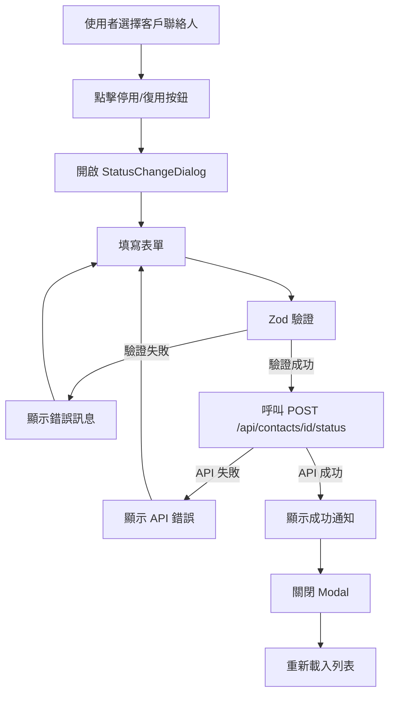

# 計畫文件 (PLAN): 客戶聯絡人異動介面 (Customer Contact Status Change UI)

**文件版本**: v1.0.0
**狀態**: 草稿 (Draft)
**建立日期**: 2026-01-01
**依據**: `1.specs/1.基本作業/1.3.客戶資料維護/客戶聯絡人異動API.spec.md`

---

## 1. 憲章遵循檢查 (Constitution Check)

| 原則 | 檢查項目 | 符合 | 說明 |
|:---|:---|:---:|:---|
| **P0: SDD 流程** | 是否有對應的 Spec 文件？ | ✅ | 依據 `客戶聯絡人異動API.spec.md` |
| **P1: 簡潔優先** | 是否避免過度設計？ | ✅ | 使用 Modal/Dialog 實作異動表單，符合現階段需求 |
| **P2: 設計即安全** | 是否考量安全性？ | ✅ | 前端與後端雙重驗證（reason 與 effectiveDate 必填） |
| **P3: 清晰可測** | 是否可測試？ | ✅ | 表單邏輯分離於 Hook，易於單元測試 |
| **P5: 正體中文** | 是否使用正體中文？ | ✅ | 所有 UI 提示與文件皆使用正體中文 |
| **P8: 一致體驗** | 是否符合設計規範？ | ✅ | 遵循 Master-Detail 佈局、Tailwind CSS 系統樣式 |
| **P8.3: 明確交易儲存** | 是否提供儲存按鈕？ | ✅ | 提供「確認」與「取消」按鈕，不採用 Auto-Save |

---

## 2. 技術架構 (Technical Architecture)

### 2.1 前端技術堆疊
- **框架**: React 18 + TypeScript
- **樣式**: Tailwind CSS
- **表單處理**: React Hook Form + Zod (Schema Validation)
- **圖示庫**: Lucide React
- **日期選擇器**: 建議使用 `react-datepicker` 或自訂元件
- **API 通訊**: Fetch API 或 Axios（需確認專案偏好）

### 2.2 資料流



**詳細流程**：
1. 使用者在客戶聯絡人列表選擇一筆記錄
2. 點擊「停用」/「復用」/「調動」按鈕
3. 開啟 Modal/Dialog，顯示異動表單
4. 表單透過 Zod 驗證（reason 與 effectiveDate 必填）
5. 驗證通過後，呼叫 API `POST /api/contacts/{contactId}/status`
6. 顯示成功/失敗通知（Toast 或 Dialog）
7. 重新載入列表或更新單筆記錄狀態

---

## 3. 檔案變更 (File Changes)

### 3.1 頁面元件

#### [NEW] `src/pages/contacts/ContactStatusChange.tsx`
- **目的**: 客戶聯絡人狀態異動頁面（整合在客戶聯絡人維護頁面中）
- **內容**:
  - 整合客戶聯絡人列表（Master）
  - 整合狀態異動表單（Modal/Dialog）
  - 整合異動歷程查詢（Tab 或側邊面板）

#### [NEW] `src/pages/contacts/ContactHistory.tsx`
- **目的**: 客戶聯絡人異動歷程查詢頁面（獨立頁面或嵌入）
- **內容**:
  - 顯示異動歷程列表（DataTable）
  - 支援分頁與篩選（actionType）
  - 顯示完整異動資訊（ActionType, Reason, EffectiveDate, CreatedBy, CreatedAt）

### 3.2 表單元件

#### [NEW] `src/components/contacts/StatusChangeForm.tsx`
- **目的**: 狀態異動表單元件（共用）
- **Props**:
  - `contactId: bigint` - 客戶聯絡人 ID
  - `currentStatus: 'Y' | 'N'` - 當前狀態（isDisabled）
  - `currentUserId: bigint | null` - 當前關聯的使用者 ID（CMP_UID）
  - `onSubmit: (data: StatusChangeFormData) => Promise<void>` - 提交回調
  - `onCancel: () => void` - 取消回調
- **表單欄位**:
  - `action` (Select): 異動類別（DISABLE/ENABLE/TRANSFER）
  - `reason` (Textarea): 異動原因（必填，最多 100 字）
  - `effectiveDate` (DatePicker): 生效日期（必填，YYYYMMDD 格式）
  - `userId` (Select, 選填): 使用者 ID（僅 action=ENABLE 且 currentUserId 為 NULL 時顯示）
- **驗證規則**:
  - reason: 必填，不可為空或空白，最多 100 字
  - effectiveDate: 必填，格式 YYYYMMDD
  - action: 必填

#### [NEW] `src/components/contacts/StatusChangeDialog.tsx`
- **目的**: 狀態異動對話框（包裝 StatusChangeForm）
- **內容**:
  - Modal/Dialog 外框
  - 標題（根據 action 動態顯示：停用/復用/調動）
  - 整合 StatusChangeForm
  - 底部按鈕列（確認、取消）
  - Loading 狀態處理
  - 錯誤訊息顯示

### 3.3 API 服務

#### [NEW] `src/services/contactService.ts`
- **目的**: 客戶聯絡人相關 API 服務
- **主要方法**:
  - `changeContactStatus(contactId: bigint, data: ContactStatusChangeRequest): Promise<ContactStatusChangeResponse>`
  - `getContactHistory(contactId: bigint, params?: ContactHistoryParams): Promise<ContactHistoryResponse>`
  - `getContactById(contactId: bigint): Promise<Contact>`

### 3.4 類型定義

#### [NEW] `src/types/contact.ts`
- **目的**: 客戶聯絡人相關 TypeScript 類型定義
- **主要類型**:
  ```typescript
  interface ContactStatusChangeRequest {
    action: 'DISABLE' | 'ENABLE' | 'TRANSFER';
    reason: string;
    effectiveDate: string; // YYYYMMDD
    userId?: bigint;
  }

  interface ContactStatusChangeResponse {
    contactId: bigint;
    action: string;
    status: 'success';
    updatedFields: {
      cmp: {
        isDisabled: string;
        statusChangeReason: string;
        statusChangeDate: string;
        statusChangeType: string;
      };
      usr?: {
        userId: bigint;
        status: number;
        updated: boolean;
      };
    };
    logId: bigint;
  }

  interface ContactHistoryItem {
    logId: bigint;
    actionType: string;
    reason: string;
    effectiveDate: string;
    createdBy: {
      userId: bigint;
      userName: string;
    };
    createdAt: string;
  }

  interface ContactHistoryResponse {
    data: ContactHistoryItem[];
    pagination: {
      page: number;
      pageSize: number;
      total: number;
      totalPages: number;
    };
  }

  interface Contact {
    id: bigint;
    name: string;
    isDisabled: 'Y' | 'N';
    userId: bigint | null;
    // ... 其他欄位
  }
  ```

### 3.5 工具函式

#### [NEW] `src/utils/dateFormatter.ts`
- **目的**: 日期格式轉換工具
- **主要方法**:
  - `formatDateForAPI(date: Date): string` - 轉換為 YYYYMMDD
  - `parseDateFromAPI(dateString: string): Date` - 從 YYYYMMDD 解析
  - `formatDateTimeForDisplay(dateTime: string): string` - 轉換為 yyyy/MM/dd HH:mm:ss
  - `formatDateForDisplay(dateString: string): string` - 轉換為 yyyy/MM/dd

---

## 4. UI/UX 設計

### 4.1 狀態異動表單設計

#### 4.1.1 佈局
- 使用 Modal/Dialog 元件（置中顯示）
- 寬度：約 600px（響應式，平板/手機自動調整）
- 標題：根據 action 動態顯示
  - DISABLE → 「停用客戶聯絡人」
  - ENABLE → 「復用客戶聯絡人」
  - TRANSFER → 「調動客戶聯絡人」

#### 4.1.2 表單欄位排列

**1. 異動類別 (action)**
- **元件**: Select（下拉選單）
- **選項**: 
  - DISABLE（停用）
  - ENABLE（復用）
  - TRANSFER（調動）
- **預設值**: 根據當前狀態自動判斷
  - 若 `isDisabled='Y'` → 預設 `ENABLE`
  - 若 `isDisabled='N'` → 預設 `DISABLE`
- **驗證**: 必填
- **顯示條件**: 始終顯示

**2. 異動原因 (reason)**
- **元件**: Textarea（多行文字輸入）
- **行數**: 3-4 行
- **提示文字**: 「請填寫異動原因（例如：離職、職務調整、廠商倒閉、合約終止等）」
- **驗證**: 
  - 必填
  - 不可為空或空白（trim 後長度 > 0）
  - 最多 100 字
- **顯示字數統計**: 右下角顯示「已輸入 X/100 字」（紅色表示超過限制）
- **即時驗證**: 失去焦點時驗證

**3. 生效日期 (effectiveDate)**
- **元件**: DatePicker（日期選擇器）
- **格式**: 
  - 顯示：`yyyy/MM/dd`（例如：2026/01/31）
  - API：`YYYYMMDD`（例如：20260131）
- **預設值**: 今天日期
- **驗證**: 
  - 必填
  - 不可選擇未來日期（或根據業務需求調整）
  - 日期格式正確性
- **即時驗證**: 選擇日期後立即驗證

**4. 使用者 ID (userId, 選填)**
- **元件**: Select（下拉選單，可搜尋）
- **顯示條件**: 僅當 `action=ENABLE` 且 `currentUserId` 為 `NULL` 時顯示
- **資料來源**: 呼叫 IAM API 2 (`GET /api/users/search?accountType=LOCAL&status=1`)
- **選項格式**: 顯示 `USER_NAME (LOCAL_ACCOUNT)`
- **提示文字**: 「選擇要開通的使用者帳號（選填，若未選擇則不開通帳號）」
- **驗證**: 選填

#### 4.1.3 按鈕列
- **左側**: 取消按鈕
  - 樣式：灰色背景，白色文字
  - 行為：點擊關閉 Modal，不儲存任何變更
- **右側**: 確認按鈕
  - 樣式：藍色背景（符合設計規範），白色文字
  - 行為：點擊提交表單
  - Loading 狀態：提交時按鈕禁用，顯示 Spinner 圖示
  - 文字變更：提交時顯示「處理中...」

#### 4.1.4 錯誤提示
- **表單驗證錯誤**: 
  - 位置：欄位下方
  - 樣式：紅色文字，小字體（text-sm text-red-600）
  - 顯示時機：欄位失去焦點或提交時
- **API 錯誤**: 
  - 位置：Modal 頂部（表單上方）
  - 樣式：紅色背景 Alert（bg-red-50 border-red-200 text-red-800）
  - 內容：顯示 API 回傳的錯誤訊息
  - 顯示時機：API 呼叫失敗時
- **成功提示**: 
  - 位置：Toast 通知（右上角）
  - 樣式：綠色背景（bg-green-50 border-green-200 text-green-800）
  - 內容：「客戶聯絡人狀態異動成功」
  - 顯示時機：API 呼叫成功後
  - 行為：顯示 3 秒後自動關閉，並關閉 Modal

### 4.2 異動歷程查詢頁面設計

#### 4.2.1 佈局
- 使用 DataTable 元件（遵循設計規範）
- 支援分頁（預設每頁 20 筆，可選 5, 10, 20, 50, 100）
- 支援篩選（actionType 下拉選單）

#### 4.2.2 表格欄位

| 欄位 | 中文名稱 | 寬度 | 格式 | 說明 |
|:---|:---|:---:|:---|:---|
| ActionType | 異動類別 | 100px | 標籤顯示 | DISABLE=紅色標籤，ENABLE=綠色標籤，TRANSFER=藍色標籤 |
| Reason | 異動原因 | 300px | 文字（可換行） | 完整顯示原因文字 |
| EffectiveDate | 生效日期 | 120px | yyyy/MM/dd | 格式化顯示 |
| CreatedBy | 經辦人 | 150px | 使用者姓名 | 顯示 USER_NAME |
| CreatedAt | 紀錄時間 | 180px | yyyy/MM/dd HH:mm:ss | 格式化顯示 |

#### 4.2.3 功能列
- **左側**: 標題「異動歷程」
- **右側**: 
  - 篩選下拉選單（全部、停用、復用、調動）
  - 重新整理按鈕（圖示）

#### 4.2.4 空狀態
- 若無資料，顯示「尚無異動記錄」提示
- 樣式：置中顯示，灰色文字，圖示（FileText）

---

## 5. 驗證計畫 (Verification Plan)

### 5.1 表單驗證（前端）

#### 5.1.1 Zod Schema

```typescript
import { z } from 'zod';

const statusChangeSchema = z.object({
  action: z.enum(['DISABLE', 'ENABLE', 'TRANSFER'], {
    errorMap: () => ({ message: '請選擇異動類別' })
  }),
  reason: z.string()
    .min(1, '異動原因為必填欄位')
    .max(100, '異動原因最多 100 字')
    .refine((val) => val.trim().length > 0, {
      message: '異動原因不可為空白'
    }),
  effectiveDate: z.string()
    .regex(/^\d{8}$/, '日期格式錯誤（應為 YYYYMMDD）')
    .refine((val) => {
      // 驗證日期有效性
      const year = parseInt(val.substring(0, 4));
      const month = parseInt(val.substring(4, 6));
      const day = parseInt(val.substring(6, 8));
      const date = new Date(year, month - 1, day);
      return date.getFullYear() === year && 
             date.getMonth() === month - 1 && 
             date.getDate() === day;
    }, {
      message: '日期無效'
    }),
  userId: z.number().optional() // 注意：bigint 在 Zod 中需轉換為 number
});
```

#### 5.1.2 即時驗證
- **欄位失去焦點時驗證**（onBlur）
- **提交時完整驗證**（onSubmit）
- **錯誤訊息即時顯示**在欄位下方
- **字數統計即時更新**（reason 欄位）

### 5.2 手動驗證

#### 5.2.1 停用流程驗證
1. 選擇已啟用的客戶聯絡人（`isDisabled='N'`）
2. 點擊「停用」按鈕
3. 確認 Modal 開啟，標題顯示「停用客戶聯絡人」
4. 確認 `action` 預設為 `DISABLE`
5. 不填寫 `reason`，點擊確認 → 應顯示錯誤「異動原因為必填欄位」
6. 填寫 `reason`（僅空白字元），點擊確認 → 應顯示錯誤「異動原因不可為空白」
7. 填寫 `reason`（超過 100 字），點擊確認 → 應顯示錯誤「異動原因最多 100 字」
8. 填寫 `reason`，不填寫 `effectiveDate` → 應顯示錯誤「生效日期為必填欄位」
9. 填寫完整資訊，點擊確認 → 應成功提交並顯示成功通知
10. 確認列表中的記錄狀態已更新為「停用」

#### 5.2.2 復用流程驗證
1. 選擇已停用的客戶聯絡人（`isDisabled='Y'`）
2. 點擊「復用」按鈕
3. 確認 Modal 開啟，標題顯示「復用客戶聯絡人」
4. 確認 `action` 預設為 `ENABLE`
5. 若 `currentUserId` 為 `NULL`，確認 `userId` 欄位顯示
6. 驗證流程同停用（步驟 5-10）
7. 若選擇 `userId`，確認 API 會建立 USR 記錄並關聯

#### 5.2.3 歷程查詢驗證
1. 選擇客戶聯絡人
2. 切換至「異動歷程」Tab 或開啟歷程查詢頁面
3. 確認顯示所有異動記錄（按時間倒序，最新的在前）
4. 測試分頁功能（切換頁碼、改變每頁筆數）
5. 測試篩選功能（選擇不同的 actionType）
6. 確認表格欄位格式正確（日期、時間格式）
7. 確認標籤顏色正確（DISABLE=紅色，ENABLE=綠色，TRANSFER=藍色）

#### 5.2.4 錯誤處理驗證
1. **網路錯誤**：
   - 模擬網路斷線
   - 確認顯示錯誤訊息「網路連線失敗，請稍後再試」
   - 確認 Modal 不會自動關閉
2. **權限錯誤**：
   - 模擬 403 Forbidden 回應
   - 確認顯示錯誤訊息「您沒有權限執行此操作」
3. **驗證錯誤**：
   - 模擬 400 Bad Request（後端驗證失敗）
   - 確認顯示後端回傳的錯誤訊息
4. **伺服器錯誤**：
   - 模擬 500 Internal Server Error
   - 確認顯示錯誤訊息「伺服器發生錯誤，請稍後再試」

---

## 6. 整合點 (Integration Points)

### 6.1 與客戶聯絡人維護頁面整合

**選項 A：嵌入在客戶聯絡人維護頁面（建議）**
- 在客戶聯絡人列表的 Toolbar 新增「停用」/「復用」按鈕
- 按鈕顯示條件：
  - 僅在選取記錄時啟用
  - 根據 `isDisabled` 狀態顯示對應按鈕（停用/復用）
  - 僅具備客戶資料維護權限的使用者才能看到
- 點擊後開啟 `StatusChangeDialog`
- 新增「異動歷程」Tab 或側邊面板，整合 `ContactHistory` 元件

**選項 B：獨立頁面**
- 建立獨立路由 `/contacts/:id/status-change`
- 從客戶聯絡人維護頁面導航至此頁面
- 使用 URL 參數傳遞 `contactId`

**建議**：採用選項 A（嵌入方式），符合「單一入口服務」設計原則，使用者體驗更流暢。

### 6.2 與 IAM API 整合

**使用者搜尋**（當 `action=ENABLE` 且 `currentUserId` 為 `NULL` 時）:
- 呼叫 IAM API 2: `GET /api/users/search?accountType=LOCAL&status=1`
- 顯示使用者列表供選擇
- 支援搜尋功能（即時搜尋，使用 `debounce` 優化）
- 選項格式：`USER_NAME (LOCAL_ACCOUNT)`
- 若搜尋無結果，顯示「找不到符合的使用者」

---

## 7. 注意事項 (Important Notes)

1. **強制驗證**：
   - 前端必須嚴格驗證 `reason` 與 `effectiveDate`，不可接受空值或空白
   - 使用 Zod Schema 進行驗證，確保與後端驗證規則一致
   - 驗證錯誤必須明確顯示給使用者

2. **日期格式**：
   - API 使用 `YYYYMMDD` 格式（8 位數字字串）
   - 前端顯示使用 `yyyy/MM/dd` 格式
   - 必須正確轉換，避免格式錯誤

3. **錯誤處理**：
   - 所有 API 錯誤都必須明確顯示給使用者
   - 區分不同類型的錯誤（網路、權限、驗證、伺服器）
   - 提供明確的錯誤訊息與建議動作

4. **Loading 狀態**：
   - 提交時必須顯示 Loading，防止重複提交
   - 按鈕禁用，顯示 Spinner 圖示
   - 表單欄位禁用（防止修改）

5. **成功後處理**：
   - 提交成功後，需更新客戶聯絡人列表或重新載入單筆記錄
   - 顯示成功通知（Toast）
   - 關閉 Modal

6. **權限檢查**：
   - 僅具備客戶資料維護權限的使用者才能看到「停用」/「復用」按鈕
   - 權限檢查應在前端與後端都實作

7. **響應式設計**：
   - Modal 寬度在平板/手機上自動調整
   - 表單欄位在小螢幕上垂直排列
   - 按鈕列在小螢幕上垂直排列

---

## 8. 後續擴充 (Future Enhancements)

1. **調動功能（TRANSFER）的完整實作**：
   - 目前僅定義欄位，具體業務邏輯待確認
   - 可能需額外欄位（如：調動至哪個部門、調動原因等）

2. **批次操作**：
   - 一次停用/復用多筆記錄
   - 需確認業務需求與權限控制

3. **匯出異動歷程**：
   - 匯出 Excel 格式的異動歷程報告
   - 支援篩選條件匯出

4. **異動預覽**：
   - 提交前顯示異動預覽（將要執行的操作）
   - 確認後才真正提交

5. **異動通知**：
   - 異動成功後，發送通知給相關人員（Email、系統通知等）

---

## 9. 參考文件

- `1.specs/1.基本作業/1.3.客戶資料維護/客戶聯絡人異動API.spec.md`
- `0.standards/4.資料庫結構分析/1.基本作業/3.客戶資料維護/CMP_TABLE.md`
- `0.standards/4.資料庫結構分析/1.基本作業/3.客戶資料維護/CMP_LOG_TABLE.md`
- `0.standards/0.專案憲章-總規範-SDD工作流程/2.文件倉儲管理系統 Warehouse Management System 設計規範v2.0.md`
- `1.specs/8.系統管理作業/8.1.身分識別與權限管理/IAM基礎API.spec.md`

---

**文件狀態**：✅ 已確認  
**最後更新**：2026-01-01
