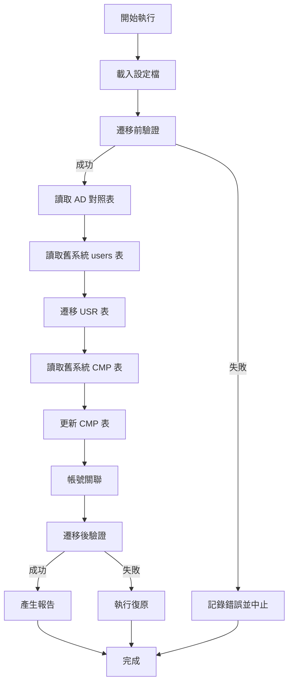

# 計畫文件 (PLAN): 資料遷移 Migration (Data Migration)

**文件版本**: v1.0.0
**狀態**: 草稿 (Draft)
**建立日期**: 2026-01-01
**依據**: `1.specs/8.系統管理作業/8.1.身分識別與權限管理/資料遷移Migration.spec.md`

---

## 1. 憲章遵循檢查 (Constitution Check)

| 原則 | 檢查項目 | 符合 | 說明 |
|:---|:---|:---:|:---|
| **P0: SDD 流程** | 是否有對應的 Spec 文件？ | ✅ | 已建立 `資料遷移Migration.spec.md` |
| **P1: 簡潔優先** | 是否避免過度設計？ | ✅ | 使用 C# Console Application，符合一次性遷移需求 |
| **P2: 設計即安全** | 是否考量安全性？ | ✅ | 遷移前完整備份，支援復原機制 |
| **P3: 清晰可測** | 是否可測試？ | ✅ | 分階段驗證，產生詳細報告 |
| **P5: 正體中文** | 是否使用正體中文？ | ✅ | 所有日誌與報告皆使用正體中文 |
| **P12: 數據治理** | 是否使用 EF Core Migrations？ | ✅ | 資料庫結構變更使用 EF Core Migrations |
| **P13: 可觀測性** | 是否使用結構化日誌？ | ✅ | 使用 Serilog 結構化日誌 |

---

## 2. 技術架構 (Technical Architecture)

### 2.1 技術堆疊
- **框架**: .NET 8.0 Console Application
- **語言**: C# 12
- **ORM**: Entity Framework Core 8.0
- **日誌**: Serilog（結構化日誌）
- **Excel 處理**: EPPlus（建議）或 ClosedXML
- **資料庫**: MS SQL Server 2022+（舊系統與新系統）

### 2.2 專案結構

```
backend/src/Migration/
├── Migration.csproj                    # 專案檔
├── Program.cs                          # 主程式進入點
├── appsettings.json                    # 設定檔（連線字串、路徑等）
├── MigrateUsersAndContacts.cs          # 主要遷移邏輯（協調器）
├── Services/
│   ├── UserMigrationService.cs         # USR 表遷移服務
│   ├── ContactMigrationService.cs      # CMP 表更新服務
│   ├── MappingService.cs               # 帳號關聯服務
│   ├── AdMappingReader.cs             # AD 對照表讀取服務
│   └── ValidationService.cs            # 資料驗證服務
├── Models/
│   ├── OldUser.cs                      # 舊系統 users 表模型
│   ├── OldContact.cs                   # 舊系統 CMP 表模型
│   ├── AdMapping.cs                    # AD 對照表模型
│   └── MigrationResult.cs              # 遷移結果模型
├── Reports/
│   ├── ExceptionReportGenerator.cs     # 例外清單產生器
│   └── ValidationReportGenerator.cs    # 驗證報告產生器
└── Utils/
    ├── SnowflakeIdGenerator.cs        # Snowflake ID 產生器
    └── ExcelHelper.cs                  # Excel 讀寫輔助類別
```

### 2.3 資料流程



---

## 3. 檔案變更 (File Changes)

### 3.1 專案檔

#### [NEW] `backend/src/Migration/Migration.csproj`
- **目的**: Migration Console Application 專案檔
- **主要套件**:
  - `Microsoft.EntityFrameworkCore.SqlServer` (8.0+)
  - `Microsoft.EntityFrameworkCore.Tools` (8.0+)
  - `Serilog` (3.x)
  - `Serilog.Sinks.File` (5.x)
  - `Serilog.Sinks.Console` (5.x)
  - `EPPlus` (6.x) 或 `ClosedXML` (0.x)

### 3.2 設定檔

#### [NEW] `backend/src/Migration/appsettings.json`
- **目的**: 遷移設定檔
- **主要設定**:
  ```json
  {
    "ConnectionStrings": {
      "OldSystem": "Server=...;Database=OldDB;...",
      "NewSystem": "Server=...;Database=NewDB;..."
    },
    "Migration": {
      "AdMappingFilePath": "path/to/AD帳號對照表.xlsx",
      "ReportOutputPath": "reports/",
      "LogOutputPath": "logs/"
    }
  }
  ```

### 3.3 主程式

#### [NEW] `backend/src/Migration/Program.cs`
- **目的**: 主程式進入點
- **主要功能**:
  - 初始化 Serilog（檔案與 Console 輸出）
  - 載入 `appsettings.json`
  - 建立 DbContext（舊系統與新系統）
  - 呼叫 `MigrateUsersAndContacts.ExecuteAsync()`
  - 錯誤處理與日誌記錄
  - 退出碼處理（0=成功，非0=失敗）

#### [NEW] `backend/src/Migration/MigrateUsersAndContacts.cs`
- **目的**: 主要遷移邏輯協調器
- **主要方法**:
  - `ExecuteAsync()`: 執行完整遷移流程
  - `PreValidationAsync()`: 遷移前驗證
  - `PostValidationAsync()`: 遷移後驗證
- **依賴注入**: 注入所有 Service（UserMigrationService, ContactMigrationService, MappingService, ValidationService, AdMappingReader）

### 3.4 服務層

#### [NEW] `backend/src/Migration/Services/UserMigrationService.cs`
- **目的**: USR 表遷移服務
- **主要方法**:
  - `MigrateUsersAsync(List<OldUser> oldUsers, Dictionary<string, AdMapping> adMappings, HashSet<string> cmpUserIds): Task<List<MigrationResult>>`
    - 讀取舊系統 users 表
    - 判斷 ACCOUNT_TYPE（依 SPEC 3.1.2 節邏輯）
    - 產生 Snowflake ID
    - 處理 PASSWORD_HASH（僅 LOCAL 帳號）
    - 批次寫入新系統 USR 表（使用 Bulk Insert 提升效能）
  - `DetermineAccountType(string userId, Dictionary<string, AdMapping> adMappings, HashSet<string> cmpUserIds): AccountType`
    - 實作 SPEC 3.1.2 節的判斷邏輯
  - `GenerateSnowflakeId(): long`
    - 呼叫 SnowflakeIdGenerator

#### [NEW] `backend/src/Migration/Services/ContactMigrationService.cs`
- **目的**: CMP 表更新服務
- **主要方法**:
  - `UpdateContactsAsync(List<OldContact> oldContacts): Task<List<MigrationResult>>`
    - 讀取舊系統 CMP 表
    - 更新 CMP_UID（先設為 NULL，後續由 MappingService 處理）
    - 更新 CMP30-32 欄位（依 SPEC 3.2.2 節邏輯）
    - 批次寫入新系統 CMP 表
  - `SetStatusChangeFields(Contact contact, string isDisabled, string disabledDate): void`
    - 設定 CMP30 (status_change_reason)
    - 設定 CMP31 (status_change_date)
    - 設定 CMP32 (status_change_type)

#### [NEW] `backend/src/Migration/Services/MappingService.cs`
- **目的**: 帳號關聯服務
- **主要方法**:
  - `MapAccountsAsync(List<Contact> contacts, Dictionary<string, long> userIdMapping): Task<MappingResult>`
    - 執行自動關聯邏輯（依 SPEC 4.1 節三層優先順序）
    - 產生例外清單（Orphan CMP, Duplicate Mapping, Missing CMP）
  - `FindUserIdMapping(string cmp00, Dictionary<string, long> userIdMapping): long?`
    - 第一優先：CMP00 = LOCAL_ACCOUNT
    - 第二優先：CMP00 = OLD_USERID
    - 第三優先：CMP00 = AD_ACCOUNT（較少見）

#### [NEW] `backend/src/Migration/Services/AdMappingReader.cs`
- **目的**: AD 對照表讀取服務
- **主要方法**:
  - `ReadAdMappingAsync(string filePath): Task<Dictionary<string, AdMapping>>`
    - 使用 EPPlus 讀取 Excel
    - 驗證欄位格式（OLD_USERID, AD_ACCOUNT, USER_NAME 必填）
    - 驗證唯一性（AD_ACCOUNT, OLD_USERID 不重複）
    - 回傳 Dictionary<OLD_USERID, AdMapping>
  - `ValidateAdMapping(AdMapping mapping): bool`
    - 驗證必填欄位
    - 驗證格式（AD_ACCOUNT 格式等）

#### [NEW] `backend/src/Migration/Services/ValidationService.cs`
- **目的**: 資料驗證服務
- **主要方法**:
  - `PreValidationAsync(): Task<ValidationResult>`
    - 檢查舊系統 users 表是否存在且可讀取
    - 檢查舊系統 CMP 表是否存在且可讀取
    - 檢查 AD 對照表格式（若提供）
    - 檢查新系統 USR 表是否為空
    - 檢查新系統 CMP 表是否為空
    - 檢查備份檔案是否存在
  - `PostValidationAsync(): Task<ValidationResult>`
    - 資料筆數驗證（USR 筆數 vs users 筆數）
    - 關聯完整性驗證（CMP_UID 外鍵檢查）
    - 資料抽樣驗證（隨機抽樣 10%）
  - `ValidateUserRecord(User user): bool`
    - 驗證必填欄位（USER_NAME, ACCOUNT_TYPE）
    - 驗證帳號唯一性
    - 驗證 PASSWORD_HASH（LOCAL 必填，AD 必為 NULL）
  - `ValidateContactRecord(Contact contact): bool`
    - 驗證 CMP_UID 外鍵（若 CMP_UID 不為 NULL，必須存在於 USR.USER_ID）
    - 驗證 CMP32 必填且值正確
    - 驗證 CMP31 格式（YYYYMMDD）

### 3.5 模型

#### [NEW] `backend/src/Migration/Models/OldUser.cs`
- **目的**: 舊系統 users 表模型
- **主要欄位**:
  ```csharp
  public class OldUser
  {
      public string UserId { get; set; }      // userid
      public string Name { get; set; }        // name
      public string Email { get; set; }       // email
      public string Department { get; set; }  // department
      public string Title { get; set; }        // title
      public string Password { get; set; }     // password (如有)
  }
  ```

#### [NEW] `backend/src/Migration/Models/OldContact.cs`
- **目的**: 舊系統 CMP 表模型
- **主要欄位**:
  ```csharp
  public class OldContact
  {
      public string CMP00 { get; set; }       // 使用者帳號
      public string CMP01 { get; set; }       // 姓名
      public string CMP20 { get; set; }       // 是否停用 (Y/N)
      public string CMP21 { get; set; }       // 停用日期 (YYYYMMDD)
      // ... 其他欄位
  }
  ```

#### [NEW] `backend/src/Migration/Models/AdMapping.cs`
- **目的**: AD 對照表模型
- **主要欄位**:
  ```csharp
  public class AdMapping
  {
      public string OldUserId { get; set; }   // 舊系統帳號
      public string AdAccount { get; set; }    // AD 帳號
      public string UserName { get; set; }      // 姓名
      public string Department { get; set; }    // 部門
      public string Title { get; set; }         // 職稱
  }
  ```

#### [NEW] `backend/src/Migration/Models/MigrationResult.cs`
- **目的**: 遷移結果模型
- **主要欄位**:
  ```csharp
  public class MigrationResult
  {
      public bool Success { get; set; }
      public string RecordId { get; set; }
      public string ErrorMessage { get; set; }
      public string ExceptionType { get; set; }
  }
  ```

### 3.6 報告產生器

#### [NEW] `backend/src/Migration/Reports/ExceptionReportGenerator.cs`
- **目的**: 例外清單產生器
- **主要方法**:
  - `GenerateExceptionReportAsync(MappingResult mappingResult): Task<string>`
    - 產生 Excel 格式的例外清單
    - 包含三個工作表：Orphan CMP, Duplicate Mapping, Missing CMP
    - 檔案名稱：`例外清單_{timestamp}.xlsx`
    - 儲存路徑：`reports/`

#### [NEW] `backend/src/Migration/Reports/ValidationReportGenerator.cs`
- **目的**: 驗證報告產生器
- **主要方法**:
  - `GenerateValidationReportAsync(ValidationResult validationResult): Task<string>`
    - 產生 Excel 格式的驗證報告
    - 包含工作表：資料筆數統計、關聯完整性、資料抽樣驗證
    - 檔案名稱：`驗證報告_{timestamp}.xlsx`
    - 儲存路徑：`reports/`

### 3.7 工具類別

#### [NEW] `backend/src/Migration/Utils/SnowflakeIdGenerator.cs`
- **目的**: Snowflake ID 產生器
- **主要方法**:
  - `GenerateId(): long`
    - 實作 Snowflake 演算法（64-bit，時間有序）
    - 確保唯一性（使用機器 ID 與序列號）
    - 單例模式（Singleton）

#### [NEW] `backend/src/Migration/Utils/ExcelHelper.cs`
- **目的**: Excel 讀寫輔助類別
- **主要方法**:
  - `ReadExcelAsync<T>(string filePath, string sheetName): Task<List<T>>`
    - 使用 EPPlus 讀取 Excel
    - 支援泛型，自動映射欄位
  - `WriteExcelAsync<T>(string filePath, string sheetName, List<T> data): Task`
    - 使用 EPPlus 寫入 Excel
    - 自動產生欄位標題

---

## 4. 執行步驟 (Execution Steps)

### 4.1 準備階段

1. **建立專案**:
   - 在 `backend/src/` 下建立 `Migration` 資料夾
   - 建立 `Migration.csproj` 專案檔
   - 安裝必要 NuGet 套件
   - 設定專案屬性（Target Framework: net8.0）

2. **設定資料庫連線**:
   - 在 `appsettings.json` 設定舊系統與新系統連線字串
   - 測試連線是否正常（使用 `SqlConnection` 測試）
   - 確認連線權限足夠（SELECT, INSERT, UPDATE）

3. **準備 AD 對照表**:
   - 確認 AD 對照表 Excel 檔案格式正確（依 SPEC 5.1 節格式）
   - 放置於指定路徑（設定於 `appsettings.json`）
   - 驗證檔案可讀取

4. **建立資料庫備份**:
   - 備份新系統資料庫（完整備份）
   - 備份舊系統資料庫（完整備份）
   - 驗證備份檔案可還原
   - 記錄備份檔案路徑與時間

### 4.2 開發階段

1. **實作 Snowflake ID 產生器**:
   - 實作 Snowflake 演算法（64-bit，時間有序）
   - 單元測試驗證唯一性（產生 10000 筆，確認無重複）
   - 單元測試驗證時間有序性（確認 ID 遞增）

2. **實作 AD 對照表讀取服務**:
   - 使用 EPPlus 讀取 Excel
   - 驗證欄位格式與必填欄位
   - 驗證唯一性（AD_ACCOUNT, OLD_USERID）
   - 單元測試驗證讀取正確性

3. **實作 USR 表遷移服務**:
   - 讀取舊系統 users 表（使用 EF Core 或 ADO.NET）
   - 判斷 ACCOUNT_TYPE（依 SPEC 3.1.2 節邏輯）
   - 產生 Snowflake ID
   - 處理 PASSWORD_HASH（僅 LOCAL 帳號，需確認舊系統密碼格式）
   - 批次寫入新系統 USR 表（使用 Bulk Insert 提升效能）
   - 單元測試驗證欄位對應正確性

4. **實作 CMP 表更新服務**:
   - 讀取舊系統 CMP 表
   - 更新 CMP_UID（先設為 NULL）
   - 更新 CMP30-32 欄位（依 SPEC 3.2.2 節邏輯）
   - 批次寫入新系統 CMP 表
   - 單元測試驗證欄位更新正確性

5. **實作帳號關聯服務**:
   - 執行自動關聯邏輯（依 SPEC 4.1 節三層優先順序）
   - 產生例外清單（Orphan CMP, Duplicate Mapping, Missing CMP）
   - 單元測試驗證關聯邏輯正確性

6. **實作驗證服務**:
   - 遷移前驗證（依 SPEC 7.1 節）
   - 遷移後驗證（依 SPEC 7.3 節）
   - 產生驗證報告
   - 單元測試驗證驗證邏輯正確性

7. **實作報告產生器**:
   - 例外清單報告（Excel，依 SPEC 4.2 節格式）
   - 驗證報告（Excel，依 SPEC 7.3 節格式）
   - 遷移摘要報告（文字檔）
   - 單元測試驗證報告格式正確性

### 4.3 測試階段

1. **單元測試**:
   - Snowflake ID 產生器測試（唯一性、時間有序性）
   - AD 對照表讀取測試（格式驗證、必填欄位檢查）
   - 帳號關聯邏輯測試（三層優先順序、例外處理）
   - 驗證服務測試（遷移前/後驗證邏輯）

2. **整合測試**:
   - 使用測試資料庫執行完整遷移流程
   - 驗證資料正確性（欄位對應、ACCOUNT_TYPE 判斷）
   - 驗證關聯正確性（CMP_UID 關聯）
   - 驗證例外清單正確性
   - 驗證報告格式正確性

3. **復原測試**:
   - 測試復原流程（模擬遷移失敗）
   - 驗證備份還原功能
   - 確認資料庫可正確還原

### 4.4 執行階段

1. **執行遷移前驗證**:
   - 檢查資料庫連線（舊系統與新系統）
   - 檢查 AD 對照表格式（若提供）
   - 檢查目標表是否為空（或確認可覆蓋）
   - 檢查備份檔案是否存在
   - 若驗證失敗，記錄錯誤並中止

2. **執行遷移**:
   - 執行完整遷移流程（依 2.3 節資料流程）
   - 監控日誌輸出（即時查看 Console 與檔案日誌）
   - 處理錯誤情況（單筆記錄失敗不中斷，記錄至例外清單）
   - 記錄每個步驟的執行時間

3. **執行遷移後驗證**:
   - 資料筆數驗證（USR 筆數 vs users 筆數）
   - 關聯完整性驗證（CMP_UID 外鍵檢查）
   - 資料抽樣驗證（隨機抽樣 10%）
   - 若驗證失敗，記錄錯誤並建議復原

4. **產生報告**:
   - 例外清單報告（Excel）
   - 驗證報告（Excel）
   - 遷移摘要報告（文字檔）
   - 所有報告儲存至 `reports/` 目錄

---

## 5. 驗證計畫 (Verification Plan)

### 5.1 自動化測試

#### 5.1.1 單元測試

**Snowflake ID 產生器測試**:
- 測試唯一性：產生 10000 筆 ID，確認無重複
- 測試時間有序性：確認 ID 遞增（時間戳記部分）
- 測試併發安全性：多執行緒同時產生 ID，確認無重複

**AD 對照表讀取測試**:
- 測試格式驗證：必填欄位缺失時應拋出異常
- 測試唯一性檢查：AD_ACCOUNT 或 OLD_USERID 重複時應拋出異常
- 測試讀取正確性：驗證讀取的資料與 Excel 一致

**帳號關聯邏輯測試**:
- 測試三層優先順序：驗證關聯順序正確
- 測試例外處理：Orphan CMP, Duplicate Mapping, Missing CMP

**驗證服務測試**:
- 測試遷移前驗證：所有檢查項目
- 測試遷移後驗證：資料筆數、關聯完整性、抽樣驗證

#### 5.1.2 整合測試

**完整遷移流程測試**:
- 使用測試資料庫執行完整遷移
- 驗證資料正確性：
  - 欄位對應正確（users → USR）
  - ACCOUNT_TYPE 判斷正確（AD vs LOCAL）
  - STATUS 設定正確
- 驗證關聯正確性：
  - CMP_UID 關聯正確
  - 外鍵完整性檢查通過
- 驗證例外清單正確性：
  - Orphan CMP 清單完整
  - Duplicate Mapping 清單完整
  - Missing CMP 清單完整

### 5.2 手動驗證

1. **遷移前驗證**:
   - 確認所有檢查項目通過（依 SPEC 7.1 節）
   - 確認備份檔案已建立
   - 確認備份檔案可還原（測試還原）

2. **遷移執行驗證**:
   - 監控日誌輸出，確認無致命錯誤
   - 確認處理進度正常（記錄筆數增加）
   - 確認每個步驟執行時間合理

3. **遷移後驗證**:
   - 檢查資料筆數統計報告（USR 筆數 = users 筆數）
   - 檢查關聯完整性報告（CMP_UID 關聯比例 > 95%）
   - 檢查例外清單報告（確認例外記錄合理）
   - 抽樣驗證資料正確性（隨機選擇 10 筆記錄，人工驗證）

4. **復原測試**:
   - 測試復原流程（模擬遷移失敗）
   - 驗證資料庫還原成功
   - 確認還原後資料庫狀態正確

---

## 6. 復原策略 (Rollback Strategy)

### 6.1 自動復原機制

- **Transaction 處理**：
  - USR 表遷移使用 Transaction（批次處理，每 100 筆一個 Transaction）
  - CMP 表更新使用 Transaction（批次處理，每 100 筆一個 Transaction）
  - 若單一 Transaction 失敗，自動回滾該批次，記錄錯誤，繼續處理後續批次

- **致命錯誤處理**：
  - 若發生致命錯誤（資料庫連線中斷、權限錯誤等），自動觸發復原建議
  - 記錄復原原因與時間
  - 產生復原建議報告

### 6.2 手動復原流程

1. **停止 Migration 程式**：
   - 若程式正在執行，先停止程式（Ctrl+C 或關閉視窗）
   - 確認程式已完全停止

2. **還原新系統資料庫**：
   - 從備份檔案還原資料庫（使用 SQL Server Management Studio 或命令列）
   - 驗證還原結果（檢查資料表是否存在、資料筆數是否正確）

3. **驗證還原結果**：
   - 執行資料完整性檢查
   - 確認所有資料表結構正確
   - 確認無資料遺失

4. **分析失敗原因**：
   - 檢視日誌檔案（`logs/migration-{timestamp}.log`）
   - 分析錯誤訊息
   - 確認失敗原因（連線問題、資料問題、程式錯誤等）

5. **修正問題後重新執行**：
   - 修正問題（修正連線字串、修正資料、修正程式碼等）
   - 重新執行測試（使用測試資料庫）
   - 確認無誤後，再次執行正式遷移

---

## 7. 日誌與報告 (Logging & Reports)

### 7.1 日誌記錄

#### 7.1.1 使用 Serilog 結構化日誌

**輸出目標**:
- 檔案：`logs/migration-{timestamp}.log`（例如：`logs/migration-20260101-143000.log`）
- Console：即時監控（彩色輸出，不同等級不同顏色）

**日誌等級**:
- Information：一般資訊（遷移開始/結束、處理進度）
- Warning：警告（例外清單記錄、驗證警告）
- Error：錯誤（單筆記錄失敗、驗證失敗）

**記錄內容**:
- 遷移開始/結束時間
- 每個步驟的執行時間（開始時間、結束時間、耗時）
- 處理的記錄筆數（成功/失敗）
- 例外清單內容（詳細記錄每個例外）
- 驗證結果（驗證通過/失敗、詳細資訊）
- 錯誤訊息（如有，包含堆疊追蹤）

**日誌格式範例**:
```
[2026-01-01 14:30:00 INF] 遷移開始執行
[2026-01-01 14:30:05 INF] 遷移前驗證完成，耗時 5 秒
[2026-01-01 14:30:10 INF] 讀取 AD 對照表完成，共 50 筆記錄
[2026-01-01 14:30:15 INF] 讀取舊系統 users 表完成，共 200 筆記錄
[2026-01-01 14:30:20 INF] 遷移 USR 表完成，成功 200 筆，失敗 0 筆，耗時 5 秒
[2026-01-01 14:30:25 WRN] Orphan CMP 記錄：CMP_ID=123, CMP00=abc, 原因=找不到對應的 USR 記錄
[2026-01-01 14:30:30 INF] 遷移後驗證完成，耗時 5 秒
[2026-01-01 14:30:35 INF] 產生報告完成，耗時 5 秒
[2026-01-01 14:30:35 INF] 遷移完成，總耗時 35 秒
```

### 7.2 報告產生

#### 7.2.1 例外清單報告 (Excel)

**檔案名稱**: `例外清單_{timestamp}.xlsx`（例如：`例外清單_20260101-143000.xlsx`）

**工作表結構**:

**工作表 1: Orphan CMP**
| CMP_ID | CMP00 | CMP01 | CM00 | 無法關聯的原因 |
|:---|:---|:---|:---|:---|
| 123 | abc | 王小明 | C001 | 找不到對應的 USR 記錄 |

**工作表 2: Duplicate Mapping**
| CMP_ID | CMP00 | CMP01 | 可能的 USR 記錄 | 無法關聯的原因 |
|:---|:---|:---|:---|:---|
| 456 | xyz | 李四 | USER_ID=111, LOCAL_ACCOUNT=xyz<br>USER_ID=222, OLD_USERID=xyz | 一個 CMP00 對應到多個 USR 記錄 |

**工作表 3: Missing CMP**
| USER_ID | ACCOUNT_TYPE | LOCAL_ACCOUNT | AD_ACCOUNT | OLD_USERID | USER_NAME | 無法關聯的原因 |
|:---|:---|:---|:---|:---|:---|:---|
| 333 | AD | NULL | xyz.123 | xyz | 張三 | 找不到對應的 CMP 記錄（可能是內部員工） |

#### 7.2.2 驗證報告 (Excel)

**檔案名稱**: `驗證報告_{timestamp}.xlsx`

**工作表結構**:

**工作表 1: 資料筆數統計**
| 項目 | 舊系統 | 新系統 | 差異 | 說明 |
|:---|:---:|:---:|:---:|:---|
| users → USR | 200 | 200 | 0 | 完全一致 |
| CMP → CMP | 500 | 500 | 0 | 完全一致 |

**工作表 2: 關聯完整性**
| 項目 | 筆數 | 比例 | 說明 |
|:---|:---:|:---:|:---|
| CMP 有 CMP_UID | 450 | 90% | 自動關聯成功 |
| CMP_UID 為 NULL | 50 | 10% | 需人工處理 |
| 外鍵完整性檢查 | 450 | 100% | 所有 CMP_UID 都存在於 USR.USER_ID |

**工作表 3: 資料抽樣驗證**
| 記錄類型 | 抽樣筆數 | 正確筆數 | 錯誤筆數 | 需人工確認 | 正確率 |
|:---|:---:|:---:|:---:|:---:|:---:|
| USR | 20 | 20 | 0 | 0 | 100% |
| CMP | 50 | 48 | 0 | 2 | 96% |

#### 7.2.3 遷移摘要報告 (文字檔)

**檔案名稱**: `遷移摘要_{timestamp}.txt`

**內容格式**:
```
========================================
資料遷移摘要報告
========================================
遷移開始時間: 2026-01-01 14:30:00
遷移結束時間: 2026-01-01 14:30:35
總耗時: 35 秒

========================================
處理筆數統計
========================================
舊系統 users 表: 200 筆
新系統 USR 表: 200 筆
轉換成功率: 100%

舊系統 CMP 表: 500 筆
新系統 CMP 表: 500 筆
更新成功率: 100%

========================================
帳號關聯統計
========================================
自動關聯成功: 450 筆 (90%)
需人工處理: 50 筆 (10%)
  - Orphan CMP: 30 筆
  - Duplicate Mapping: 10 筆
  - Missing CMP: 10 筆

========================================
驗證結果
========================================
遷移前驗證: 通過
遷移後驗證: 通過
資料筆數驗證: 通過
關聯完整性驗證: 通過
資料抽樣驗證: 通過

========================================
報告檔案
========================================
例外清單: reports/例外清單_20260101-143000.xlsx
驗證報告: reports/驗證報告_20260101-143000.xlsx
日誌檔案: logs/migration-20260101-143000.log
```

---

## 8. 注意事項 (Important Notes)

1. **資料庫連線**:
   - 舊系統與新系統必須可同時連線
   - 連線字串需正確設定（包含認證資訊）
   - 確認連線權限足夠（SELECT, INSERT, UPDATE）
   - 建議使用專用的遷移帳號，避免使用生產環境帳號

2. **Transaction 處理**:
   - USR 表遷移使用 Transaction（批次處理，每 100 筆一個 Transaction）
   - CMP 表更新使用 Transaction（批次處理，每 100 筆一個 Transaction）
   - 確保失敗時可回滾（單一 Transaction 失敗不影響其他 Transaction）
   - 使用 `DbContext.Database.BeginTransaction()` 確保原子性

3. **效能考量**:
   - 大量資料遷移時，考慮批次處理（每批 100-1000 筆）
   - 使用 Bulk Insert 提升效能（`BulkInsertAsync` 或 `AddRange` + `SaveChangesAsync`）
   - 避免逐筆插入（效能差）
   - 考慮使用 `AsNoTracking()` 提升讀取效能

4. **錯誤處理**:
   - 單筆記錄失敗不應中斷整個遷移
   - 記錄失敗記錄至例外清單
   - 繼續處理後續記錄
   - 記錄詳細錯誤訊息（包含堆疊追蹤）

5. **資料驗證**:
   - 遷移前必須完整驗證（依 SPEC 7.1 節）
   - 遷移後必須完整驗證（依 SPEC 7.3 節）
   - 產生詳細驗證報告
   - 驗證失敗時，建議執行復原

6. **密碼處理**:
   - 舊系統密碼格式需確認（可能是明文、MD5、SHA1 等）
   - 若舊系統使用舊式雜湊，需重新雜湊為新格式（bcrypt/argon2）
   - 若無法重新雜湊，建議設定為「需強制變更密碼」（`FORCE_CHANGE_PWD=1`）

7. **日期格式**:
   - 舊系統日期格式需確認（可能是 `YYYYMMDD`, `YYYY-MM-DD`, `YYYY/MM/DD` 等）
   - 統一轉換為新系統格式（`YYYYMMDD` 或 `datetime`）

---

## 9. 參考文件

- `1.specs/8.系統管理作業/8.1.身分識別與權限管理/資料遷移Migration.spec.md`
- `0.standards/4.資料庫結構分析/8.系統管理作業/1.身分識別與權限管理/USR_使用者主檔.md`
- `0.standards/4.資料庫結構分析/1.基本作業/3.客戶資料維護/CMP_TABLE.md`
- `0.standards/4.資料庫結構分析/8.系統管理作業/1.身分識別與權限管理/0.2.客戶資料維護與IAM整合設計總結.md`
- `0.standards/4.資料庫結構分析/8.系統管理作業/1.身分識別與權限管理/0.身分識別與帳號整合策略.md`

---

**文件狀態**：✅ 已確認  
**最後更新**：2026-01-01
